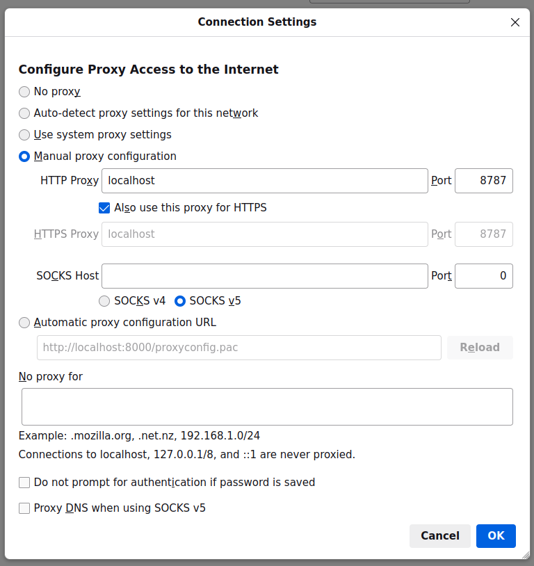

## Usage

1. Create a directory on the host for holding the UNIX Domain sockets for the CARDS deployments running on that server.

```bash
mkdir ~/cards-deployment-sockets
```

2. Start a CARDS deployment that exposes its services via forward-proxy over a UNIX Domain socket transported WebSocket.

```bash
cd ..
python3 generate_compose_yaml.py --cards_docker_image cards/cards4prems:latest --dev_docker_image --oak_filesystem --forward_proxy --forward_proxy_websocket_unix_listen ~/cards-deployment-sockets/cards4prems.sock
docker-compose build
docker-compose up -d
cd forward_proxy_gateway
```

3. Generate a `htpasswd` file for securing access to the deployment(s).

```bash
htpasswd -c ~/cards-deployments.htpasswd user
```

4. Create the appropriate _routes_ for Nginx. This is done by creating the appropriate directory and files under
`nginx-conf`. For example, for a _Cards4PREMs_ deployment, under `nginx-conf`, we have the following files:

- `cards4prems/location.conf`
```
location /cards4prems/ {
  proxy_pass http://cards4prems/;
}
```

- `cards4prems/upstream.conf`
```
upstream cards4prems {
  server unix:/cards-deployment-sockets/cards4prems.sock;
}
```

Therefore, to create the routing for a new deployment (let's use _Cards4HERACLES_ for this example), the following files
under `nginx-conf` would need to be created:

- `cards4heracles/location.conf`
```
location /cards4heracles/ {
  proxy_pass http://cards4heracles/;
}
```

- `cards4heracles/upstream.conf`
```
upstream cards4heracles {
  server unix:/cards-deployment-sockets/cards4heracles.sock;
}
```

5. Start with:

```bash
docker run --rm -v $(realpath nginx.conf):/etc/nginx/nginx.conf:ro -v $(realpath nginx-conf):/nginx-conf:ro -v $(realpath ~/cards-deployments.htpasswd):/htpasswd:ro -v $(realpath ~/cards-deployment-sockets):/cards-deployment-sockets -p 8585:8080 -it nginx
```

6. Ensure that you have built the `forwardproxyclient` Docker image, then, connect to the deployment with:

```bash
docker run --rm -p 8787:8888 -e CARDS_MOCK_SERVER_WEBSOCKET_URL=ws://domain.name.of.cards.deployment:8585/cards4prems/ -e AUTH="user:password" -it forwardproxyclient
```

7. Then, configure your web browser to use the proxy. In Firefox, this can be done by visiting `about:preferences`,
selecting _Network Settings_, then selecting _Manual proxy configuration_ using a _HTTP Proxy_ of `localhost` on _Port_ `8787`.


